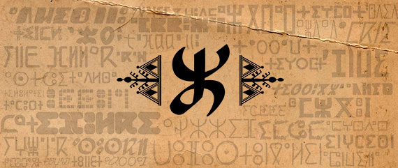

# Unicode Fonts for Amazigh (Tifinagh)
Webpage: https://abdelhaqueidali.github.io/Unicode-Fonts-For-Amazigh-Tifinagh/

This repository provides a collection of Unicode fonts specifically designed for the Amazigh (Berber) language and its Tifinagh script. Most fonts here are from the Royal Institution of Amazigh in Morocco, and the Foundation of Tawalt from Libya, as well as from inidviduals. This repo has those fonts with incompability issus with unicode encoded Tifinagh. Now you may freely type in Tifinagh and exprect the Tifinagh glyphs as they should be.

**[Download All Fonts](https://github.com/abdelhaqueidali/Unicode-Fonts-For-Amazigh-Tifinagh/archive/refs/heads/main.zip)**

Note: Most of these fonts go with only the 33 standard letters of the Alphabet, with Tawalt fonts missing the sign ⵯ, so make sure if it appears correctls or do remove it.

**Featured Fonts Banner:**

More fonts will be added in the future.

---

**ⵜⵉⵙⵉⵙⴽⵍⵉⵏ (ⵜⵓⵏⵉⵖⵉⵏ) ⵉ ⵓⴳⵎⵎⴰⵢ ⴰⵎⴰⵣⵉⵖ, ⵜⵉⴼⵉⵏⴰⵖ.**

ⵉⵙⵎⵓⵏ ⵓⵙⴰⴳⵯⵎ ⴰⴷ ⵜⵓⴳⵜ ⵏ ⵜⵙⵉⵙⴽⵍⵉⵏ ⵏ ⵢⵓⵏⵉⴽⵓⴷ ⵉⵥⵍⵉⵏ ⵙ ⵜⵓⵜⵍⴰⵢⵜ ⵜⴰⵎⴰⵣⵉⵖⵜ ⴷ ⵓⵙⴽⴽⵉⵍ ⵏⵏⵙ, ⵜⵉⴼⵉⵏⴰⵖ. ⵜⵉⵙⵉⵙⴽⵍⵉⵏ ⴰⴷ ⵜⵜⵓⵙⴽⴰⵔⵏⵜ *ⵙⵖⵓⵔ* ⵉⵎⵙⵙⵉⵡⵍⵏ ⵙ ⵜⵎⴰⵣⵉⵖⵜ *ⵉ* ⵜⵉⵔⵔⴰ ⵜⴰⵎⴰⵣⵉⵖⵜ.

**[ⴰⴳⵯⵎ ⵎⴰⵕⵕⴰ](https://github.com/abdelhaqueidali/Unicode-Fonts-For-Amazigh-Tifinagh/archive/refs/heads/main.zip)**

ⵔⴰⴷ ⵜⵜⵔⵏⵓⵏⵜ ⵜⵉⵢⵢⴰⴹ ⴳ ⵉⵎⴰⵍ.

---

## Acknowledgements

We extend our sincere gratitude to the following individuals and organizations for their contributions to the development of Tifinagh fonts:

*   **Organizations:**
    *   [Tawalt](https://tawalt.tinussan.com)
    *   [l'Institut Royal de la Culture Amazighe (IRCAM)](https://www.ircam.ma)

*   **Individuals:**
    *   [Madghis U'Madi](https://www.facebook.com/madimadghis)
    *   Borawy Al Hjaj
    *   [Idriss Ait Omar](https://www.facebook.com/profile.php?id=100089678837305)
    *   Ayt Lmuddn Mrym
    *   Madeleine Leddy (Fedra Font)
    *   Walid Bouchouchi (Amadal Font)
    *   Ahmed Ait Attman (Ammouri fonts)
    *   [Marwan Yadri](https://www.facebook.com/marwanyadri8) (Marwan Font)

A general thank you to everyone who has created or contributed to the creation of any Amazigh font, including those not explicitly mentioned here. We apologize if we have missed listing any fonts or contributors; some fonts from mentioned individuals are still to be uploaded.

---

## ⴰⵔ ⵏⵙⵏⵉⵎⵎⵉⵔ

ⴰⵔ ⵏⵙⵏⵉⵎⵎⵉⵔ ⵙ ⵓⵢⴰⴼⵓ ⵉⵎⵇⵇⵓⵔⵏ ⵉ ⵢⵉⵎⵙⵓⵜⴰⵢ ⴷ ⵜⵎⵙⵎⵓⵏⵉⵏ ⴰⴷ ⴼ ⵜⵉⴷⵔⴰⵡⵉⵏ ⵏⵏⵙⵏ ⴳ ⵓⵙⵏⴼⵍⵓⵍ ⵏ ⵜⵙⵉⵙⴽⵍⵉⵏ ⵏ ⵜⴼⵉⵏⴰⵖ:

*   **ⵜⵉⵎⵙⵎⵓⵏⵉⵏ:**
    *   [Tawalt](https://tawalt.tinussan.com)
    *   [ⴰⵙⵉⵏⴰⴳ ⴰⴳⵍⴷⴰⵏ ⵏ ⵜⴷⵍⵙⴰ ⵜⴰⵎⴰⵣⵉⵖⵜ (IRCAM)](https://www.ircam.ma)

*   **ⵉⵎⴷⴰⵏⵏ:**
    *   [ⵎⴰⴷⵖⵉⵙ ⵓⵎⴰⴷⵉ](https://www.facebook.com/madimadghis)
    *   ⴱⵓⵕⴰⵡⵉ ⴰⵃⵊⵊⴰⵊ
    *   [ⴷⵔⵉⵙ ⴰⵢⵜ ⵄⵓⵎⴰⵕ](https://www.facebook.com/profile.php?id=100089678837305)
    *   ⴰⵢⵜ ⵍⵎⵓⴷⴷⵏ ⵎⵔⵢⵎ
    *   ⵎⴰⴷⵍⵉⵏ ⵍⴰⴷⵉ (Fedra Font)
    *   ⵡⴰⵍⵉⴷ ⴱⵓⵛⵓⵛⵉ (Amadal Font)
    *   ⴰⵃⵎⴰⴷ ⴰⵢⵜ ⵄⵜⵎⴰⵏ (Ammouri fonts)
    *   [ⵎⴰⵕⵡⴰⵏ ⵢⴰⴷⵔⵉ](https://www.facebook.com/marwanyadri8) (Marwan Font)
    
    ⵜⴰⵏⵎⵎⵉⵔⵜ ⵉ ⴽⵓⵍⵍⵓ ⵎⴰⵏⵡⴰⴷ ⵉⵙⴽⵔⵏ ⴽⵔⴰ ⵏ ⵜⵙⵉⵙⴽⵍⵜ ⵜⴰⵎⴰⵣⵉⵖⵜ ⵏⵉⵖ ⵉⴷⵔⴰ ⴳ ⵓⵙⴽⴰⵔ ⵏⵏⵙ. ⵜⴰⵏⵎⵎⵉⵔⵜ ⵉ ⵎⴰⵕⵕⴰ ⵡⴰⵏⵏⴰ ⵓⵔ ⵉⵜⵜⴱⴷⵔⵏ. ⴰⵙⵓⵔⴼ ⵉⵖ ⵏⵜⵜⵓ ⵓⵔ ⵏⴱⴷⵉⵔ ⴽⵔⴰ ⵏ ⵢⴰⵏ; ⴽⵔⴰ ⵏ ⵜⵙⵉⵙⴽⵍⵉⵏ ⵏ ⴽⵔⴰ ⵏ ⵎⴷⴷⵏ ⴰⴷ ⵉⵜⵜⵓⴱⴷⴰⵔⵏ ⵓⵔ ⵜⴰ ⵜⵜⵓⵔⵏⴰⵏⵜ ⵖⵉⴷ.
---

**Collected and Uploaded by:** Abdelhaque Id Ali
**ⴰⵙⵎⵓⵏ ⴷ ⵓⵙⴽⵜⵔ:** ⵄⴱⴷⵍⵃⵇ ⵉⴷ ⵄⵍⵉ
