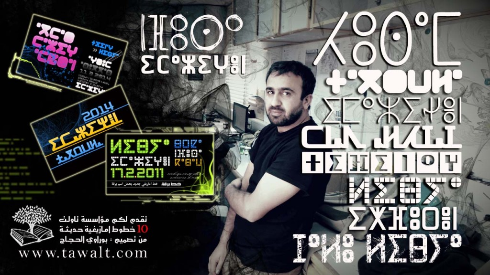

# Borawy 200 Unicode fonts (Not finished) - ⵜⵉⵙⵉⵙⴽⵍⵉⵏ ⵏ ⴱⵓⵕⴰⵡⵉ 200 ⵢⵓⵏⵉⴽⵓⴷ/ⵜⴰⵢⵏⴳⴰⵍⵜ (ⵙⵓⵍ ⴳ ⵜⵡⵓⵔⵉ)
 
 [Link to the original fonts from Tawalt - ⴰⵙⵖⵓⵏ ⵙ ⵜⵉⵙⵉⵙⴽⵍⵉⵏ ⵜⵉⵥⵖⵓⵕⴰⵏⵏ ⵙⴳ ⵜⴰⵡⴰⵍⵜ](https://tawalt.tinussan.com/)
 ⴷⴰ ⵜⵜⵉⵔⵉⵏⴷ ⵜⵉⴷ ⵜⵉⵥⵖⵓⵕⴰⵏⵏ ⴰⴷ ⵜⵜⴰⵔⴰⴷ ⵙ ⵓⵍⴰⵜⵉⵏ ⴼⴰⴷ ⴰⴷ ⵉⴳ ⵜⵉⴼⵉⵏⴰⵖ. ⵜⵉⴼⵉⴼⵖⵜ ⵏ ⵢⵓⵏⵉⴽⵓⴷ ⴷⴰ ⵉⵍⵍⴰⵏ ⴳ ⵖⵉⴷ ⴰⵔ ⵙⵡⵓⵔⵉⵏⵜ ⴷ ⵜⴼⵉⵏⴰⵖ. ⴷ ⵓⵍⴰ ⴽⵔⴰ ⵏ ⵜⵎⵓⴽⵔⵉⵙⵉⵏ ⵜⴻⵜⵜⴼⵙⵉⵏⵜ ⴳⵉⵙⵏⵜ. ⵔⴰⴷ ⵜⴻⵜⵜⵔⵏⵓⵏⵜ ⵜⵓⵏⵉⵖⵉⵏ ⵎⴰⵕⵕ ⵙ ⵉⵎⵉⴽⴽ.
 Original ones need you to type in latin for tifinagh. Unicode versions which are in this repository work with Tifinagh. Also some issues in the original fonts are fixed. All the fonts will be added gradually.
